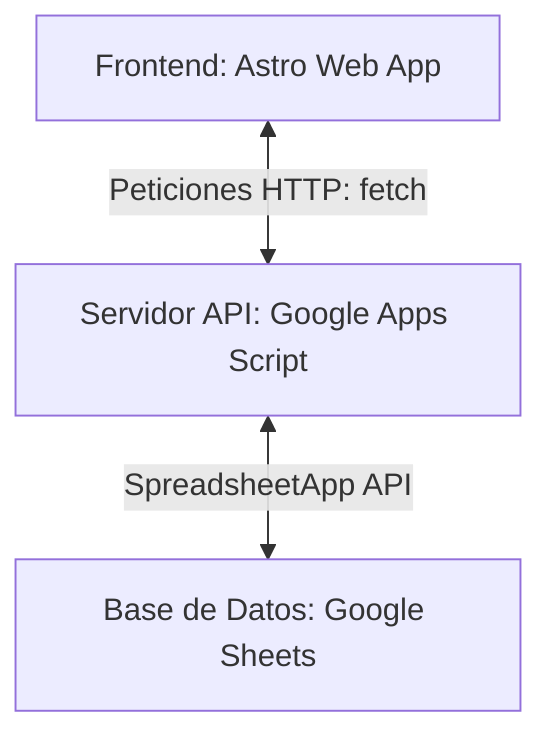

# Arquitectura y Funcionamiento del Proyecto: Titan Gym

Este documento contiene la explicación técnica y operativa de cómo está diseñado y conectado el sistema de administración de Titan Gym. Sirve como registro documental para entender el engranaje del software antes de realizar cambios en el código.

---

## 1. Arquitectura General del Sistema

El proyecto utiliza una arquitectura **Cliente-Servidor (Serverless)** dividida en tres capas principales:



### Capa 1: El Cliente / Interfaz Web (Frontend)
* **Tecnología:** [Astro](https://astro.build/) + HTML + Javascript + Tailwind CSS.
* **Función:** Es la pantalla visual con la que interactúa el usuario administrador del gimnasio. Aquí se muestran las tablas de miembros, el control de accesos, el formulario de registro y la caja del Punto de Venta (POS).
* **Cómo se comunica:** No se conecta directamente a la base de datos. En su lugar, realiza peticiones web estándar (`fetch`) a la URL pública del servidor para pedir u otorgar información.

### Capa 2: El Servidor / API Intermedia (Backend)
* **Tecnología:** Google Apps Script (Javascript en los servidores de Google).
* **Función:** Recibe las peticiones del frontend, procesa la lógica de negocio (por ejemplo, verificar si el estado es ACTIVO antes de permitir una entrada) y realiza las consultas correspondientes en las hojas de cálculo.
* **Enrutamiento:** Utiliza un archivo principal llamado `API.gs` que expone dos funciones globales de Google:
  * `doGet(e)`: Maneja consultas de lectura.
  * `doPost(e)`: Maneja inserciones o modificaciones de datos.

### Capa 3: La Base de Datos (Storage)
* **Tecnología:** Google Sheets.
* **Función:** Almacena la información de manera persistente en tablas (pestañas). Es sumamente útil porque permite al usuario ver y editar los datos directamente desde un navegador usando una hoja de cálculo familiar.

---

## 2. Estructura de la Base de Datos (Tablas y Columnas)

El libro de Google Sheets contiene pestañas que funcionan como tablas de una base de datos relacional:

### Pestañas Existentes y Operativas:
1. **`membresias` (Catálogo de Planes):**
   * `id`: Clave primaria del plan.
   * `nombre`: Nombre del plan (ECO, WEEK, etc.).
   * `duracion`: Duración en días.
   * `precio`: Costo de la membresía.
2. **`miembros` (Padrón de Clientes):**
   * `id`: ID incremental del miembro.
   * `nombre`: Nombre completo del cliente.
   * `correo`: Correo electrónico.
   * `fecha alta`: Fecha en que se registró.
   * `plan actual`: Plan contratado actualmente.
   * `ultimo pago`: Fecha del último pago registrado.
   * `fecha vencimiento`: Cálculo automático vía fórmula.
   * `dias restantes`: Cálculo de días vigentes usando la fórmula `=INT(vencimiento) - TODAY()`.
   * `estatus`: Estado del miembro (`ACTIVO`, `POR VENCER`, `VENCIDO`) calculado automáticamente.
   * `ultimo acceso`: Fecha del último escaneo en puerta.
3. **`accesos` (Historial de Visitas):**
   * `Fecha y hora`: Marca de tiempo del escaneo.
   * `IdMiembro`: ID del cliente que ingresó.
   * `Nombre`: Nombre del cliente.
   * `Estatus Acceso`: `ACTIVO` (permitido) o `DENEGADO`.
   * `Dias Restantes`: Días vigentes al momento de entrar.
4. **`renovacion` (Historial de Pagos de Membresías):**
   * `id`: ID único del pago.
   * `id miembro`: ID del miembro que pagó.
   * `fecha pago`: Fecha de transacción.
   * `plan contratado`: Plan comprado.
   * `precio`: Monto cobrado.
   * `metodo de pago`: Efectivo, Tarjeta, etc.
5. **`productos` (Inventario de Tienda):**
   * `codigo`: ID único o código de barras del producto.
   * `nombre`: Nombre descriptivo (ej. Whey Protein).
   * `categoria`: Categoría del producto (Suplementos, Bebidas, etc.).
   * `precio`: Precio unitario de venta.
   * `stock`: Cantidad disponible en almacén.
   * `imagen`: Enlace URL de la imagen del producto.

### Pestañas Propuestas para los Módulos Pendientes:
1. **`pos` (Historial de Ventas del POS):**
   * `id`, `fecha`, `tipoCliente`, `miembro`, `nombre`, `categoria`, `producto`, `cantidad`, `precio unitario`, `total cobrado`, `metodo de pago`.
2. **`finanzas` (Libro Mayor de Caja - Ingresos y Egresos):**
   * `fecha`, `ventas`, `gastos`, `concepto`, `fondo caja`.

---

## 3. Endpoints de la API y Scripts del Backend

Para la comunicación entre el frontend (Astro) y Google Sheets, se utiliza Google Apps Script estructurado de la siguiente forma:

### Enrutamiento Central (`API.gs`)
Maneja las peticiones GET/POST redirigiendo según el parámetro `action`:
```javascript
function doGet(e) {
  try {
    const accion = e.parameter.action;
    let respuesta;

    switch (accion) {
      // ... otros casos ...
      case "catalogoProductos":
        respuesta = obtenerTodosLosProductos(); 
        break;
      // ... otros casos ...
    }
    return ContentService.createTextOutput(JSON.stringify(respuesta))
      .setMimeType(ContentService.MimeType.JSON);
  } catch (error) {
    return ContentService.createTextOutput(JSON.stringify({ exito: false, error: error.toString() }))
      .setMimeType(ContentService.MimeType.JSON);
  }
}

function doPost(e) {
  try {
    const datos = JSON.parse(e.postData.contents);
    const accion = datos.action;
    let respuesta;

    switch (accion) {
      // ... otros casos (ej. registrarRenovacion, registrarNuevoMiembro) ...
      case "registrarVentaPOS":
        respuesta = registrarVentaPOS(datos);
        break;
      default:
        respuesta = { exito: false, mensaje: "❌ Acción POST no reconocida." };
    }
    
    return ContentService.createTextOutput(JSON.stringify(respuesta))
                         .setMimeType(ContentService.MimeType.JSON);
  } catch (error) {
    return ContentService.createTextOutput(JSON.stringify({ exito: false, mensaje: error.toString() }))
                         .setMimeType(ContentService.MimeType.JSON);
  }
}
```

### Script de Productos (`productos.gs`)
Se encarga de conectarse a la pestaña `productos` y extraer la lista completa del catálogo:
```javascript
/**
 * Obtiene todos los productos disponibles en la pestaña "productos".
 */
function obtenerTodosLosProductos() {
  try {
    const sheetApp = SpreadsheetApp.openById("1W0q0Bl1wftUfz413Gdvy_9N-k1nIv0FseJtzdRfLZIw");
    const hojaProductos = sheetApp.getSheetByName("productos") || sheetApp.getSheetByName("Productos");
    
    if (!hojaProductos) throw new Error("No se encontró la pestaña 'productos'.");
    
    const valores = hojaProductos.getDataRange().getValues();
    const listaProductos = [];
    
    // Empezamos en 1 para saltar los encabezados (codigo, nombre, categoria, precio, stock, imagen)
    for (let i = 1; i < valores.length; i++) {
      if (!valores[i][0]) continue; // Si no hay código, ignorar fila
      
      listaProductos.push({
        codigo: valores[i][0],
        nombre: valores[i][1],
        categoria: valores[i][2],
        precio: Number(valores[i][3]) || 0,
        stock: Number(valores[i][4]) || 0,
        imagen: valores[i][5] || ""
      });
    }
    
    Logger.log("Productos cargados: " + listaProductos.length);
    return { exito: true, datos: listaProductos };
    
  } catch (error) {
    return { exito: false, mensaje: "Error al obtener productos: " + error.toString() };
  }
}
```

### Script de Punto de Venta (`pos.gs`)
Registra la compra (múltiples filas para un ticket) en la pestaña `pos`, descuenta el stock en `productos` e ingresa la venta en `finanzas`:
```javascript
/**
 * Registra una venta del Punto de Venta (POS) en la base de datos (Google Sheets).
 * Descuenta el stock y registra el ingreso en finanzas.
 */
function registrarVentaPOS(datosVenta) {
  try {
    const sheetApp = SpreadsheetApp.openById("1W0q0Bl1wftUfz413Gdvy_9N-k1nIv0FseJtzdRfLZIw");
    
    const hojaPOS = sheetApp.getSheetByName("pos") || sheetApp.getSheetByName("POS");
    const hojaProductos = sheetApp.getSheetByName("productos") || sheetApp.getSheetByName("Productos");
    const hojaFinanzas = sheetApp.getSheetByName("finanzas") || sheetApp.getSheetByName("Finanzas");
    
    if (!hojaPOS) throw new Error("No se encontró la pestaña 'pos'.");
    if (!hojaProductos) throw new Error("No se encontró la pestaña 'productos'.");
    if (!hojaFinanzas) throw new Error("No se encontró la pestaña 'finanzas'.");
    
    const fechaHora = new Date();
    // Formato de fecha para Excel/Google Sheets
    const fechaFormateada = Utilities.formatDate(fechaHora, Session.getScriptTimeZone(), "yyyy-MM-dd HH:mm:ss");
    const fechaSoloDia = Utilities.formatDate(fechaHora, Session.getScriptTimeZone(), "yyyy-MM-dd");
    
    // 1. Obtener siguiente ID único para la transacción
    const valoresPOS = hojaPOS.getDataRange().getValues();
    let siguienteIdPOS = 1001; // ID inicial por defecto
    
    if (valoresPOS.length > 1) {
      // Buscamos el ID numérico más alto en la columna A
      let maxId = 0;
      for (let i = 1; i < valoresPOS.length; i++) {
        const idActual = Number(valoresPOS[i][0]);
        if (!isNaN(idActual) && idActual > maxId) {
          maxId = idActual;
        }
      }
      if (maxId > 0) {
        siguienteIdPOS = maxId + 1;
      }
    }
    
    // 2. Registrar cada producto del carrito en la pestaña POS y descontar stock
    const productosVenta = datosVenta.productos; // Array de productos
    const valoresProductos = hojaProductos.getDataRange().getValues();
    
    for (let p = 0; p < productosVenta.length; p++) {
      const item = productosVenta[p];
      
      // A. Escribir fila en pos
      // Columnas: id, fecha, tipoCliente, miembro, nombre, categoria, producto, cantidad, precio unitario, total cobrado, metodo de pago
      const nuevaFilaPOS = [
        siguienteIdPOS,
        fechaFormateada,
        datosVenta.tipoCliente || "Público General",
        datosVenta.miembro || "",
        datosVenta.nombre || "Público General",
        item.categoria || "",
        item.nombre,
        item.cantidad,
        item.precioUnitario,
        item.subtotal,
        datosVenta.metodoPago
      ];
      
      hojaPOS.appendRow(nuevaFilaPOS);
      
      // B. Descontar Stock en productos
      for (let i = 1; i < valoresProductos.length; i++) {
        if (valoresProductos[i][0] == item.codigo) {
          const filaProducto = i + 1;
          const stockActual = Number(valoresProductos[i][4]) || 0;
          const nuevoStock = Math.max(0, stockActual - item.cantidad);
          
          hojaProductos.getRange(filaProducto, 5).setValue(nuevoStock); // Columna E (Stock)
          break;
        }
      }
    }
    
    // 3. Registrar transacción totalizadora en la pestaña Finanzas
    // Columnas: fecha, ventas (Ingresos), gastos, concepto, fondo caja
    const filaDestinoFinanzas = hojaFinanzas.getLastRow() + 1;
    
    // Fórmula para calcular fondo caja sumando venta actual y restando gastos actuales al saldo anterior
    const formulaFondoCaja = "=E" + (filaDestinoFinanzas - 1) + "+B" + filaDestinoFinanzas + "-C" + filaDestinoFinanzas;
    
    const nuevaFilaFinanzas = [
      fechaSoloDia,
      datosVenta.totalCobrado, // Ingresos (ventas)
      0,                       // Gastos (egresos)
      "Venta POS - Ticket #" + siguienteIdPOS, // Concepto
      formulaFondoCaja        // Fondo Caja (Fórmula)
    ];
    
    hojaFinanzas.appendRow(nuevaFilaFinanzas);
    
    Logger.log("Venta registrada con éxito. Ticket #" + siguienteIdPOS);
    return {
      exito: true,
      mensaje: "🛍️ Venta registrada con éxito. Stock y Caja actualizados.",
      idTicket: siguienteIdPOS
    };
    
  } catch (error) {
    return {
      exito: false,
      mensaje: "Error al registrar la venta: " + error.toString()
    };
  }
}
```

---

## 4. Preguntas Frecuentes (FAQ)

### ¿Se usaron bots o scripts automáticos en el chat para hacer esto?
No. Todo funciona a través de peticiones HTTP estándar de desarrollo web. Google Apps Script permite publicar scripts como **Aplicación Web**, lo que crea un enlace público que responde a comandos directamente de la página web de Titan Gym sin necesidad de intermediación de bots.

### ¿Se tuvo que configurar algo especial en Google Sheets para conectarlo al código?
Sí, una configuración básica pero indispensable en Google:
1. **Identificador del Documento:** Se le indica al código a qué archivo de Drive conectarse usando el ID único de la hoja de cálculo.
2. **Cuentas de Acceso:** Se configura el Google Script para que se ejecute bajo tu propia cuenta de Google, pero permitiendo el acceso a *"Cualquier persona, incluso anónima"* (Anyone, even anonymous), para que la aplicación web no requiera iniciar sesión en Google a cada cliente o dispositivo.

### ¿Qué significa exactamente esta línea en los archivos `.gs`?
```javascript
const sheetApp = SpreadsheetApp.openById("1W0q0Bl1wftUfz413Gdvy_9N-k1nIv0FseJtzdRfLZIw")
```
* **Respuesta:** En Google Apps Script, `SpreadsheetApp` es la librería interna de Google para manejar hojas de cálculo. El método `.openById("...")` abre el archivo de Excel/Sheets exacto que tiene ese ID en la URL de tu navegador. Si cambias de archivo de Sheets en el futuro, solo debes cambiar esa cadena de texto por el nuevo ID del documento para que todo siga funcionando transparentemente.

### ¿Por qué se inyectan fórmulas directamente desde el código en lugar de calcular las fechas en Javascript?
* **Respuesta:** Al inyectar fórmulas de Sheets (como `DATEVALUE` o `TODAY()`) directamente a las celdas al registrar o actualizar miembros, el trabajo matemático y de actualización de fechas lo hace el propio motor de Google. Así, si abres el Google Sheets en tu celular o computadora sin usar la app web, verás los días restantes y estados actualizados en tiempo real de forma nativa.
